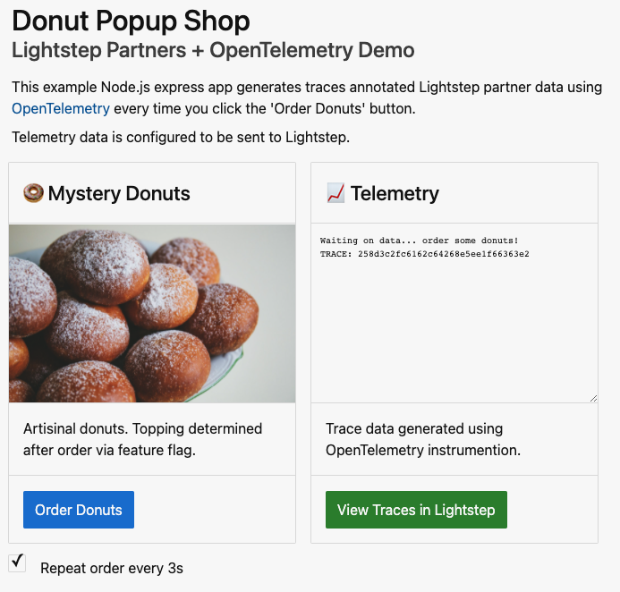

# Lightstep Partner Toolkit

Technical toolkit for Lightstep partners that want to adopt OpenTelemetry or use Lightstep's API to build better workflows.

 

## ⏰ Getting Started

| What | Why |
| ------- | ------ |
| [Try the Demo Service](#-demo)  | See working code first, ask questions later. |
| [Integrate with OpenTelemetry](#-integrate-with-opentelemetry) | Use OpenTelemetry to make your product, service, tool, or SDK more valuable. |
| [Integrate with Lightstep](#-integrate-with-lightstep) | Connect to Lightstep insights using alerting or our API. |
| [Contact us](#%EF%B8%8F-contact-us) | 👋 to Lightstep's Partner team. |

 

## 💻 Demo

Run [Donut Shop](./demo/README.md) locally to understand how OpenTelemetry can connect different tools and solutions together. Our example app creates distributed traces that contain data related to relevant feature flags, errors, user analytics, and supporting cloud services using code in this toolkit.

> 💡 It's also possible to run Donut Shop on a fully-featured Kuberentes cluster using the AWS CDK. See example [here](./examples/aws).

  
 
 
 
  
 
## 📓 Integrate with OpenTelemetry

What would you like to accomplish?

| Category | What |
| ------- | ------ |
| [General](./docs/otel/instrument.md) | Start here if you're not sure which category fits best. |
| [Cloud Services and Infrastructure](./docs/otel/cloud-services.md) |  Improve visibility into cloud services or infrastructure. |
| [Errors](./docs/otel/errors.md) | Enrich error analytics in microservice environments. |
| [Feature Flags](./docs/otel/feature-flags.md) | Streamline deployment management with feature flags connected to observability workflows. |
| [Incident Management](./docs/otel/incident-management.md) | Create better workflows for incident response and post-mortems. |
| [Chaos Engineering](./docs/otel/chaos.md)| Create more resilient systems and measure the impact of chaos experiments. |
| [User Analytics and Customer Experience](./docs/otel/user-analytics.md) | Correlate user analytics with technical performance.  |

  
 
## 🔦 Integrate with Lightstep

What would you like to accomplish?

| Category | What |
| ------- | ------ |
| [Alerting](https://docs.lightstep.com/docs/create-and-manage-destinations) | Connect to alerts to the full context of Lightstep's observability platform including deployment tags, service map information, and change intelligence |
| [CI/CD](https://docs.lightstep.com/paths/git-hub-action-path) | Provide pre-deploy service health checks, active rollout monitoring, and full change intelligence for unexpected deployment behavior |

 
 
## ✉️ Contact Us

Say hi to Lightstep's Partner Team: partnerships@lightstep.com or fill out the form [here](https://go.lightstep.com/contact-us-partners.html). We're here to help and answer any questions about or product or OpenTelemetry.
