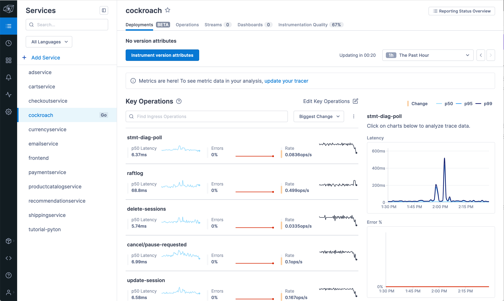

## Lightstep + CockroachDB

[Cockroach Labs](https://www.cockroachlabs.com/) has instrumented their database using open standards so developers and database engineers can identify performance problems. Lightstep is natively supported by Cockroach as a source for trace data.

This is an example of how to use metrics and traces from [CockroachDB](https://github.com/cockroachdb/cockroach) with Lightstep.

### 📝 Requirements

* CockroachDB
* Lightstep + Lightstep Access Token for sending telemetry
* [OpenTelemetry Collector](https://github.com/open-telemetry/opentelemetry-collector) (for metrics, optional)

### 🛠 Setup

#### Enable tracing on cluster

Set the URL to your CockroachDB instance using an enviornment varable:

```
# For a local development cluster:
export COCKROACH_HOST=localhost:26257
export COCKROACH_INSECURE=true
```

Enable distribute tracing (warning: there will be some overhead using these settings, proceed carefully on production systems!):

```
cockroach sql -e "SET CLUSTER SETTING sql.trace.session_eventlog.enabled = true;"
cockroach sql -e "SET CLUSTER SETTING trace.debug.enable = true;"
```

Set your Lightstep access token so data is sent to Lightstep

```
cockroach sql --insecure --host localhost -e "SET CLUSTER SETTING trace.lightstep.token = '<your token>';"
```

### 💽 Generating test data and telemetry

#### Sample Database

The CockroachDB CLI comes bundled with a client that can create and generate a test database with traffic called [movr](https://www.cockroachlabs.com/docs/stable/movr.html).

```
cockroach workload init movr
```

Generate a workload for 5 minutes:

```
cockroach workload run movr --duration=5m
```

#### Viewing Traces

Verify traces are being created in CockroachDB by visiting the debug page: `http://localhost:8080/debug/requests?fam=tracing&b=-1`

In Lightstep, telemetry on requests to CockroachDB will be visible inside the "Cockroach" service: `https://app.lightstep.com/your-project-name-here/service-directory/cockroach/deployments`



That's it!

🎬
