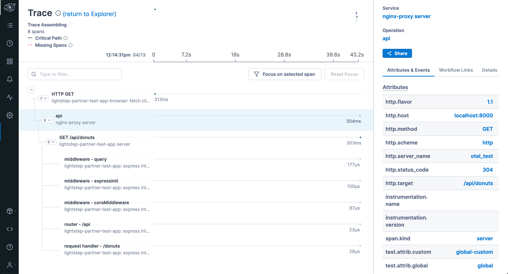

## Lightstep + Nginx

Work in progress. nginx with OpenTelemetry tracing based on [opentelemetry-cpp-contrib](https://github.com/open-telemetry/opentelemetry-cpp-contrib/tree/main/instrumentation/nginx).

This is a proof-of-concept web app that starts nginx with web backend(s) and sends data to a collector that forwards traces to Lightstep.

#### Running the demo

```
  # 1) Bring up nginx + app server
  $ export LS_ACCESS_TOKEN=<access-token>
  $ docker compose up

  # 2) Make some requests to generate traces!
  $ open http://localhost:8000/

  # 3) Open Lightstep to investigate
```



#### Docker image

`$ docker pull ghcr.io/lightstep/lightstep-partner-toolkit-otel-nginx:latest`